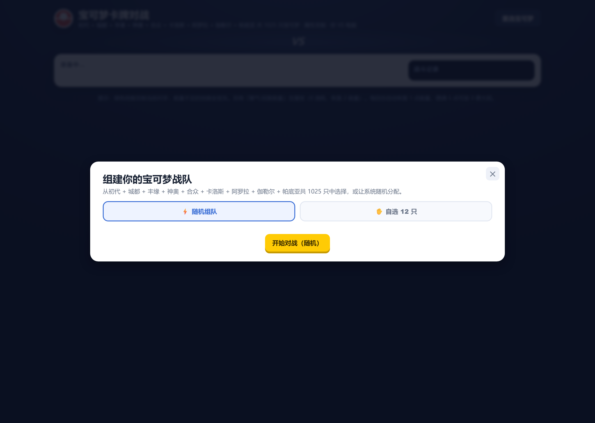
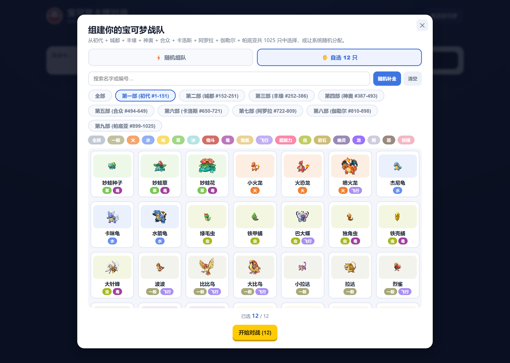
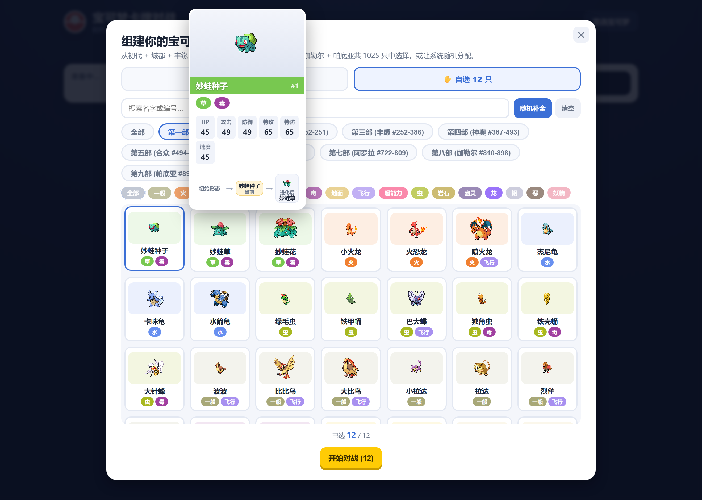
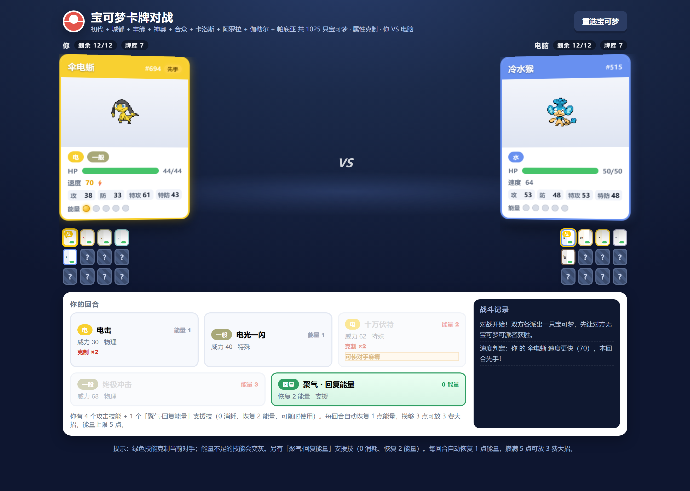
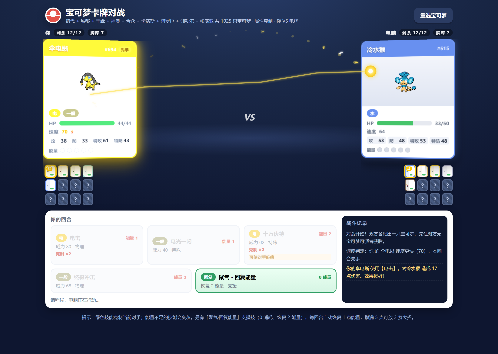
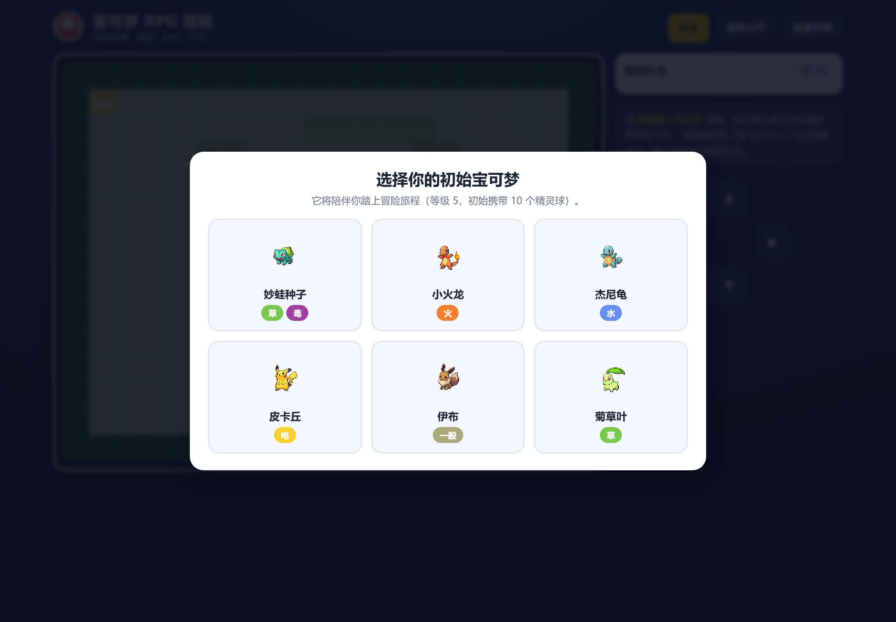
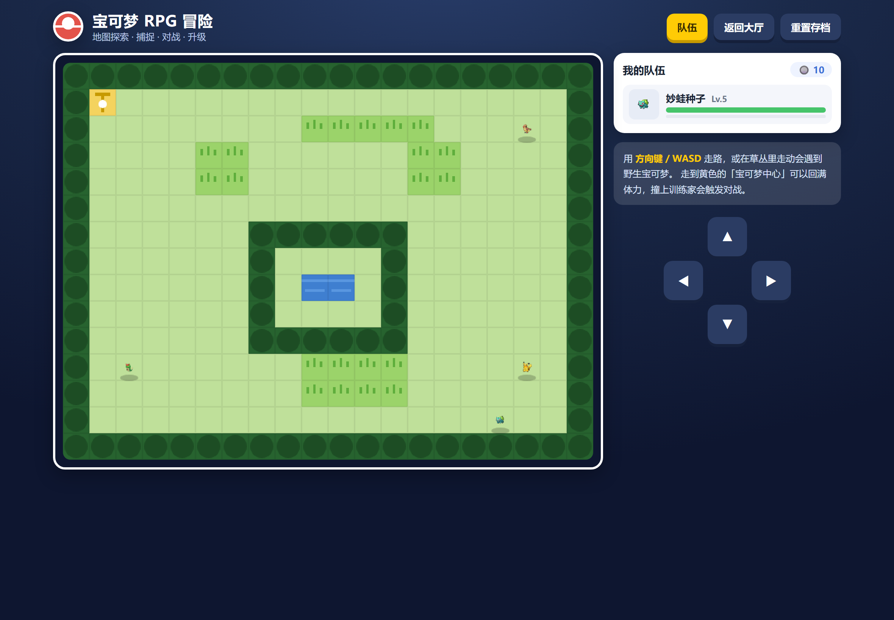
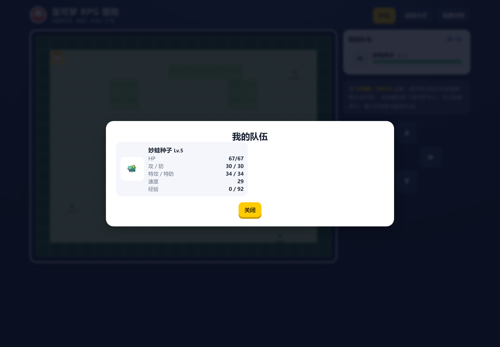
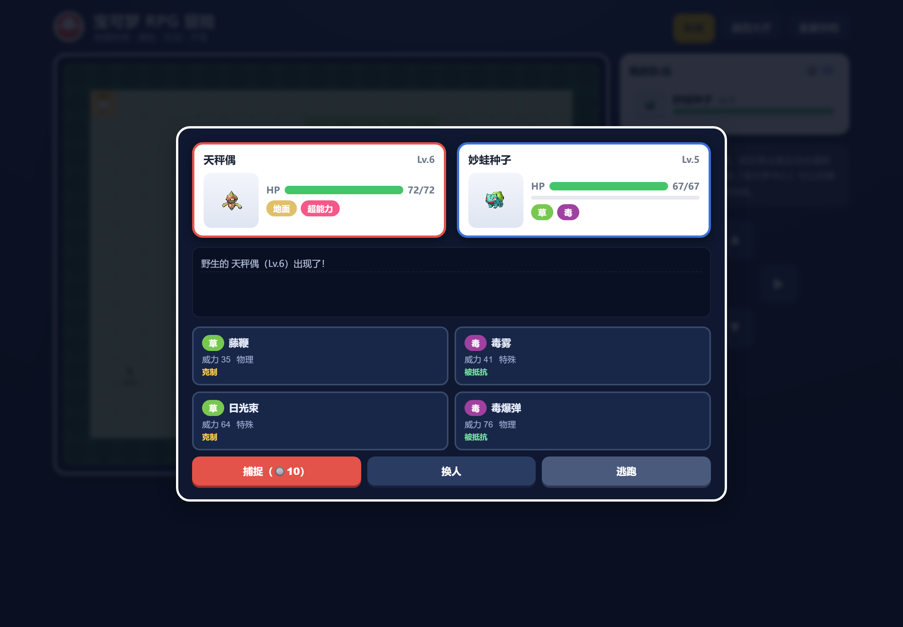

# 宝可梦卡牌对战 🃏⚡

一个用纯网页（HTML + CSS + JavaScript）做的宝可梦卡牌对战小游戏，孩子和我（电脑）各带一支 12 只宝可梦的战队，靠**属性克制**、**能量管理**和**超级进化**一决高下。

> 这是做给我儿子玩的小项目：打开网页就能玩，不用装任何东西，全中文界面，九代宝可梦全收录（共 1025 只）。

---

## ✨ 游戏特色

- **全图鉴收录**：初代（关都）到第九代（帕底亚）全部 1025 只宝可梦，含属性、种族值、进化链与官方超级进化形态。
- **自己组队**：可以「⚡ 随机组队」一键开打，也可以「✋ 自选 12 只」从图鉴里慢慢挑，还能按**世代**和**属性**筛选、搜名字。
- **属性克制**：18 种属性完整相克表，绿色「克制 ×N」提示帮你选克制对手的招式，效果拔群伤害更高。
- **能量系统**：每只宝可梦每回合自动 +1 能量（上限 5）。1 / 2 / 3 费招式各有所长，攒满能量放 3 费大招。
- **支援技「聚气·回复能量」**：0 消耗，恢复 2 点能量，还能解除自身异常状态，关键时刻翻盘。
- **异常状态**：中毒、灼烧、麻痹、睡眠、冰冻——在战斗中会持续产生影响，策略性更强。
- **速度先手**：每回合比拼双方出战宝可梦的速度，快的先出手。
- **超级进化（Mega Evolution）**：拥有 mega 形态的宝可梦（如妙蛙花、喷火龙、超梦…），全场一次、消耗 2 能量即可进化，攻防速全面提升。
- **悬浮预览**：在对战或选人界面把鼠标移到宝可梦上，会弹出大图、属性、六维数值以及**进化链**。
- **战斗特效**：卡牌 3D 侧身、出手蓄力、命中抖动、伤害飘字、暴击震屏、进化闪光，纯 Canvas 粒子动画。
- **RPG 冒险模式**：独立的 `rpg.html` 模式，地图探索、野外遭遇、捕捉宝可梦、训练家对战、队伍升级，体验不一样的玩法。

---

## 🕹️ 怎么玩

1. 双击打开 `pokemon-battle.html`（用任意现代浏览器，如 Chrome / Edge / Safari 都可以）。
2. 第一次打开会弹出「组建你的宝可梦战队」：
   - 想马上玩 → 点 **⚡ 随机组队**，再点 **开始对战**。
   - 想自己选 → 点 **✋ 自选 12 只**，在图鉴里挑满 12 只，再点开始。
3. 进入对战界面：
   - 下方是你的 4 个攻击技能 + 1 个「聚气·回复能量」支援技，点一下就出招。
   - 能量不足的按钮会变灰，攒够能量再放。
   - 后备宝可梦（12 格阵型里的小卡）可以点击**换上场**。
   - 有超级进化机会时，会出现 **MEGA** 按钮。
4. 把对方的 12 只宝可梦全部击败就获胜！结束后点「重选宝可梦」再来一局。

> 🗺️ 想玩 RPG 冒险模式？直接用浏览器打开 `rpg.html`：选初始宝可梦、在地图上探索、捕捉野生宝可梦、挑战训练家并升级队伍。

> 💡 小贴士：对战界面最下方有一行操作提示；把鼠标悬停在宝可梦卡牌上能看到克制关系和详细数值。

> 🌐 需要联网：宝可梦的图片来自公开图鉴 CDN，首次加载需要网络连接（断网时会显示编号占位图，不影响游戏）。

---

## 🖼️ 界面预览

**组队弹窗** —— 打开即见，可一键随机组队或进入自选模式：



**自选图鉴** —— 按「世代 / 属性」筛选、搜名字，挑满 12 只（下图已切到初代并选满）：



**悬浮预览** —— 鼠标移到宝可梦上，弹出大图、六维数值与**进化链**（以妙蛙种子为例）：



**对战主界面** —— 双方卡牌、HP 条、能量、技能栏（绿字为克制提示）、战斗记录与 12 格阵型一应俱全：



**出招特效** —— 蓄力、命中、伤害飘字、暴击震屏，纯 Canvas 粒子动画：



---

## 🗺️ RPG 冒险模式

除了卡牌对战，还可以打开 `rpg.html` 进入 **RPG 冒险模式**：在地图上探索、捕捉野生宝可梦、与训练家对战并升级队伍。

**选择初始宝可梦** — 游戏开始时从 6 只经典初始宝可梦中挑选一只伙伴，携带 10 个精灵球出发：



**地图探索** — 用方向键 / WASD 或右下角的十字键在草地上走动，会遭遇野生宝可梦；撞上训练家触发对战；黄色建筑是宝可梦中心，可以回满体力：



**队伍详情** — 点击顶部「队伍」按钮查看当前宝可梦的等级、HP、攻防等状态：



**野生对战 / 捕捉** — 遭遇野生宝可梦后，可选择招式、捕捉、换人或逃跑；招式同样显示克制 / 被抵抗提示：



---

## 📖 游戏规则速览

| 项目 | 说明 |
| --- | --- |
| 战队规模 | 双方各 12 只（1 出战 + 4 后备 + 7 牌库） |
| 招式 | 每只 4 招（1 费 / 1 费 / 2 费 / 3 费）+ 1 支援技 |
| 能量 | 每回合 +1，上限 5；支援技回 2，mega 耗 2 |
| 先手 | 每回合比较出场宝可梦速度 |
| 克制 | 18 属性相克，克制方伤害 ×2（部分更高），被抵抗 ×0.5，无效 ×0 |
| 异常状态 | 中毒 / 灼烧（持续掉血）、麻痹（可能跳过）、睡眠 / 冰冻（无法行动若干回合） |
| 超级进化 | 符合条件且能量≥2 时可用，全场每队限一次 |
| 胜负 | 先让对方无宝可梦可派者获胜 |

---

## 🗂️ 目录结构

```
baokemeng/
├── pokemon-battle.html   # 卡牌对战入口页面
├── rpg.html              # RPG 冒险模式入口页面
├── rpg.css               # RPG 模式样式
├── rpg.js                # RPG 模式逻辑（地图、捕捉、升级、战斗）
├── index.html            # （如有）同入口的镜像页
├── styles.css            # 卡牌对战界面样式
├── battle-fx.css         # 战斗特效样式
├── game.js               # 卡牌对战全部游戏逻辑（回合、战斗、AI、渲染）
├── battle-fx.js          # Canvas 粒子特效引擎
├── data.js               # 1025 只宝可梦数据 + 18 属性克制表（自动生成）
├── build_data.py         # 数据生成脚本（从图鉴生成 data.js）
├── gen2_data.py … gen9_data.py  # 各世代数据
├── gen_evo_data.py       # 进化链与超级进化数据
├── test_game.js          # 无头逻辑自测
├── screenshots/          # 界面展示截图
├── README.md             # 本文件
└── LICENSE               # Apache License 2.0
```

---

## 🔧 本地运行 / 二次开发

直接用浏览器打开 `pokemon-battle.html` 即可，无需构建、无需服务器。

若想本地起一个静态服务器（可选）：

```bash
# 任选其一
python -m http.server 8000
# 然后浏览器访问 http://localhost:8000/pokemon-battle.html
```

自测游戏逻辑（Node 环境）：

```bash
node --check game.js      # 语法检查
node test_game.js         # 无头模拟对战 + 数据断言
```

重新生成数据（需要 Python）：

```bash
python build_data.py      # 依据各世代脚本重新产出 data.js
```

---

## 📜 许可协议

本项目以 **Apache License 2.0** 发布。详见 [LICENSE](./LICENSE)。

简要说明：你可以自由地使用、修改、分发本项目，包括用于个人和家庭用途；只需保留版权与许可声明，且 Apache 2.0 不包含担保。

---

## 🙏 数据来源与致谢

- 宝可梦数值、属性、进化链数据来源于公开的 [PokéAPI](https://pokeapi.co/) 图鉴。
- 宝可梦精灵图（sprite）来自 [PokeAPI/sprites](https://github.com/PokeAPI/sprites) 仓库。
- 宝可梦相关名称与素材的版权归 Pokémon / Nintendo / Game Freak 等原权利人所有；本项目仅用于学习与家庭娱乐，非官方作品。


## RPG 关都篇章（对标红蓝）
- 10 章节主线：真新镇 → 8 道馆 → 石英高原四天王/冠军
- 系统：徽章、金钱 ₽、友好商店、背包、PP/命中/STAB/暴击/异常状态
- 入口：`rpg.html`；旧存档自动迁移 money/badges/items
